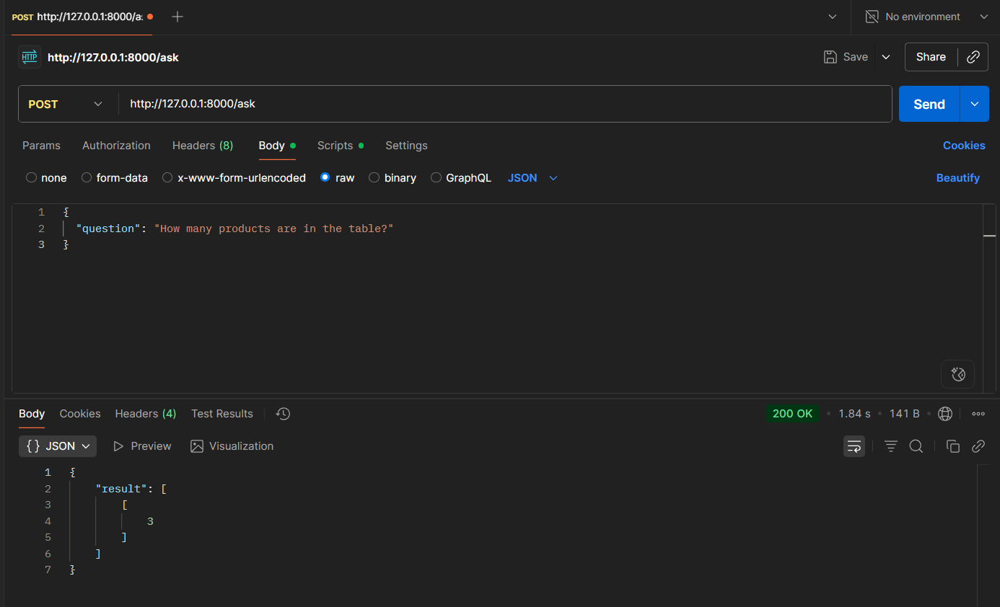
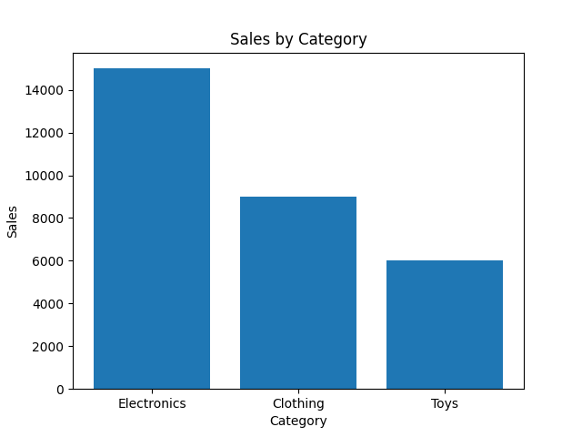

# 🛒 Ecom AI Agent – Gemini-Powered SQL Assistant

An AI-powered FastAPI application that answers **natural language questions** about your e-commerce data using **Gemini 1.5 (Google Generative AI)** and visualizes results with charts.

---

## ✨ Features

- 🧠 **LLM-Powered**: Converts plain English questions to SQL using Gemini 1.5
- 💽 **Database**: Queries your local `ecom.db` (SQLite)
- ⚡ **FastAPI Backend**: Quick `/ask` endpoint for integration
- 📊 **Chart Support**: Generates visual charts using `matplotlib`
- 🖥️ **Frontend**: Clean HTML interface to input questions
- 🚫 **Error Handling**: Handles invalid questions, unsupported queries

---

## 📦 Technologies Used

- **FastAPI** (Python)
- **Gemini 1.5 Flash API**
- **SQLite**
- **Matplotlib** (for charts)
- **HTML/JS/CSS** (frontend)

---

## 💬 Example Questions You Can Ask

- "How many products are in the table?"
- "Show revenue by category"
- "What is the average price of all products?"
- "Which product has the highest sales?"
- "List all products with stock less than 10."

---

## 🖼️ Screenshots

### 🔹 Natural Question → Answer + Chart

---

### 🔹 Postman Testing: "How many products?"

---

### 🔹 Visual Output

---

## 📂 Project Structure

